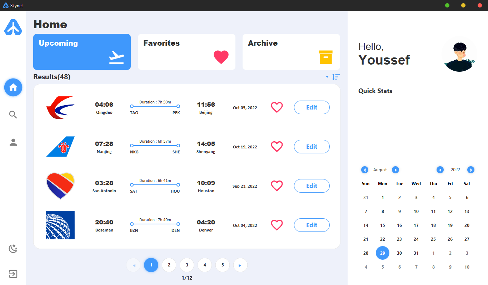
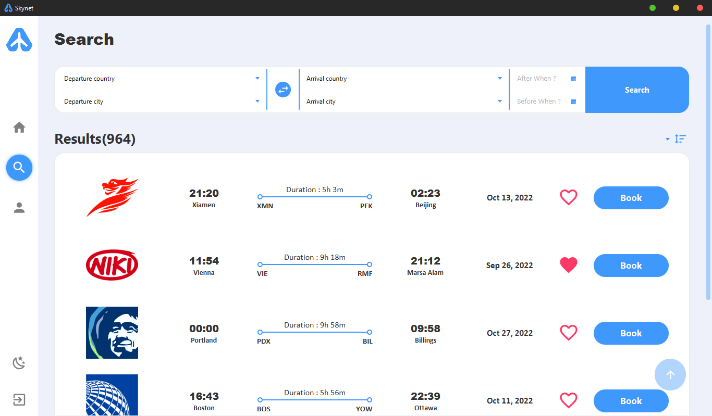
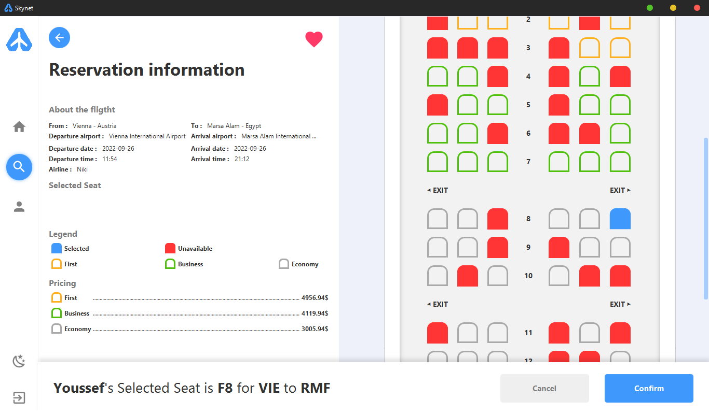
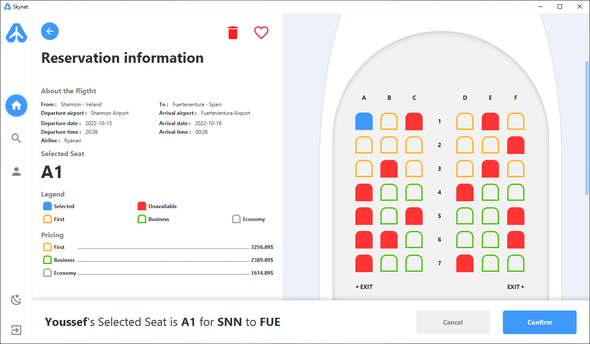
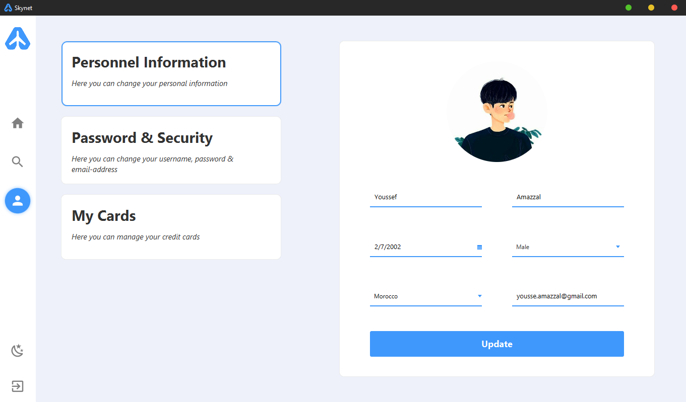
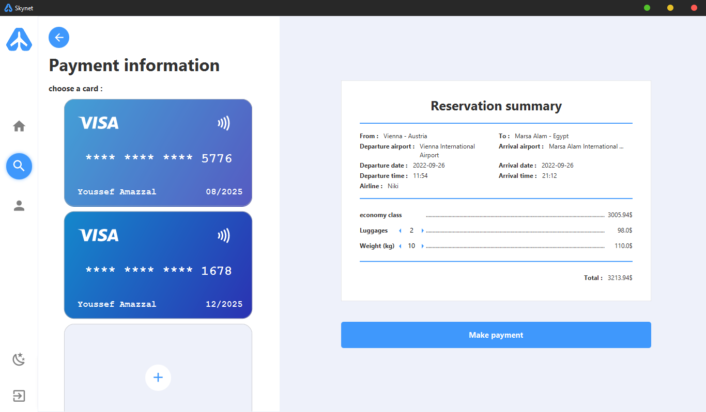
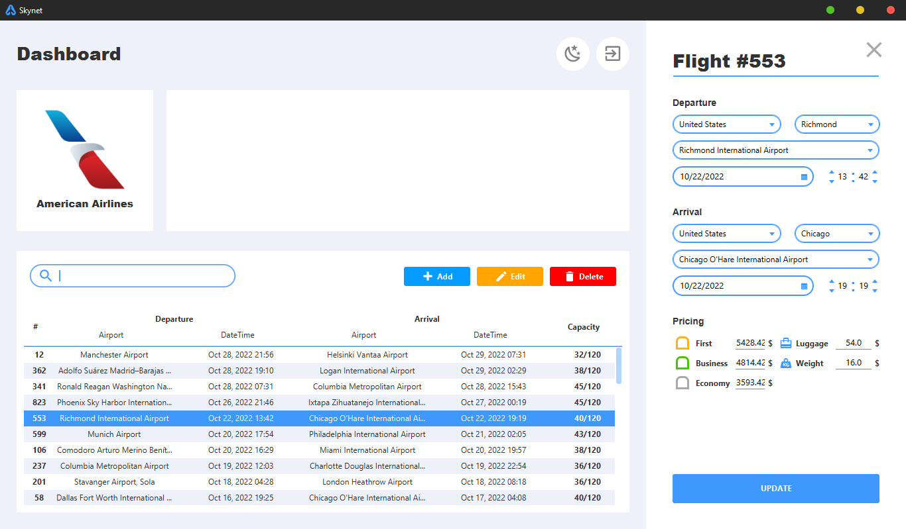
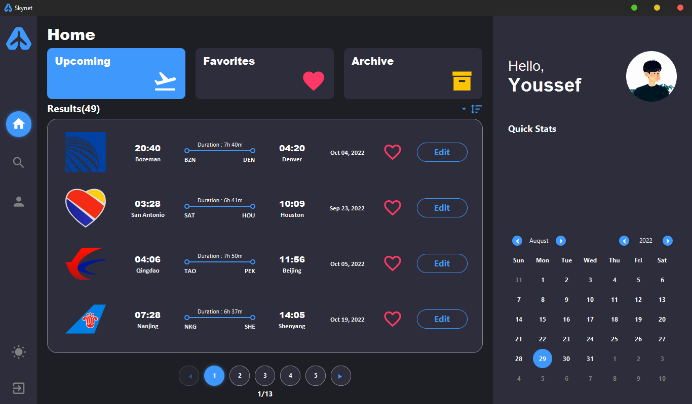

# Skynet - Flight Booking System

## What is Skynet?
It is an academic project that aims to provide a comprehensive flight booking platform for both passengers and airlines. It is a desktop application that is built using Java and JavaFX. The application is built using the MVC design pattern.

The program features include:
- **Book and manage flights** - passengers can book flights and manage their bookings.
- **Filter & Sort:** search and sort flights based on different criteria such as departure and arrival destinations, date range, price range, flight duration, airline, and more.
- **Choosing preferred seat:** option to select a specific seat on the flight during the booking process.
- **Edit profile:** ability to update personal information and preferences in the user's profile.
- **Switch between Dark and light mode:** option to switch between a dark and light color scheme for better visibility and user experience.
- **Keep favorite flights:** option to save flights to a list of favorites for easy access.
- **Dashboard for airlines:** a dedicated interface for airlines to add, manage, and update their flights, such as flight schedules, prices, and seat availability.

This project is designed for academic purposes, to demonstrate the understanding of the concepts and technologies learned during the first year.

## Screenshots

